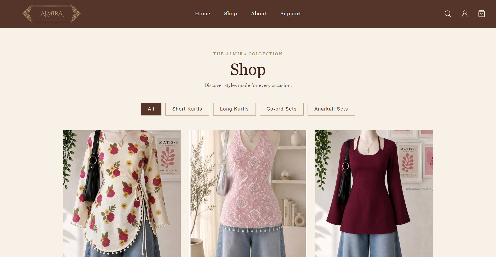
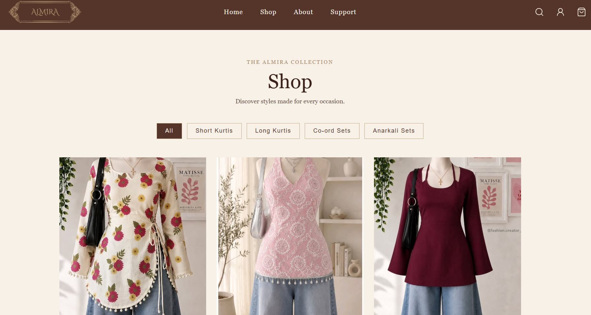
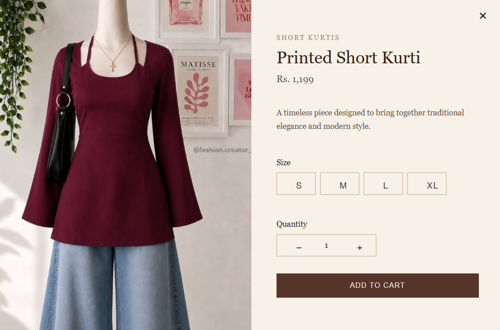
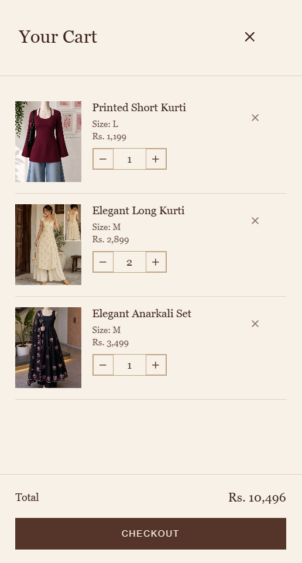
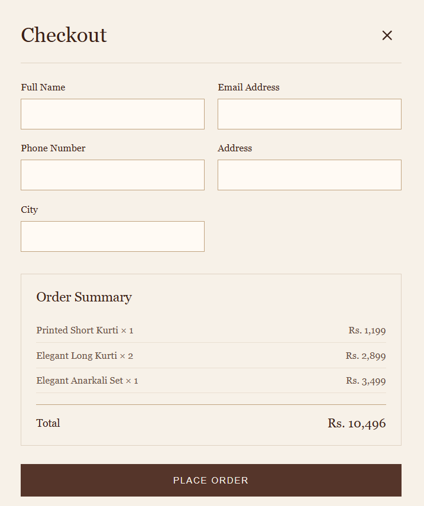
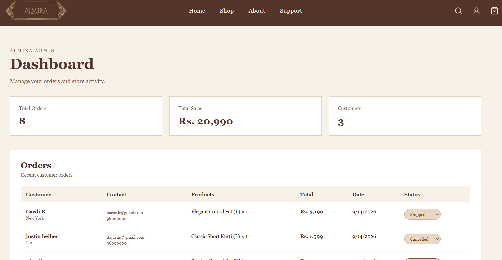

# Almira — E-Commerce Fashion Website

Almira is a full-stack e-commerce fashion website inspired by South Asian traditional fashion and modern elegance. The website allows customers to browse products, select sizes and quantities, add products to a cart, place orders, and receive an order confirmation email.

It also includes an admin dashboard where store orders can be viewed and their status can be updated.

---

## Screenshots

### Homepage :



<br>

### Shop :



<br>

### Product Details :



<br>

### Shopping Cart :



<br>

### Checkout :



<br>

### Admin Dashboard :




---

## Features

### Customer Side

* Responsive homepage with hero section and product categories
* Product collection with category filtering
* Product details popup
* Size selection
* Quantity controls
* Shopping cart
* Checkout form
* Customer login and registration
* Order confirmation
* Order confirmation email
* About page
* Customer Support page

### Admin Side

* Admin dashboard
* Total orders overview
* Total sales calculation
* Unique customer count
* Customer order information
* Order status management
* Order status updates saved to MongoDB

---

## Product Categories

Almira currently includes:

* Short Kurtis
* Long Kurtis
* Co-ord Sets
* Anarkali Sets

---

## Technologies Used

### Frontend

* React
* Vite
* JavaScript
* CSS
* React Router
* Lucide React

### Backend

* Node.js
* Express.js
* MongoDB
* Resend
* dotenv
* CORS

### Database

* MongoDB Atlas

---

## How It Works

The basic order flow is:

Customer browses products
↓
Selects product, size and quantity
↓
Adds product to cart
↓
Proceeds to checkout
↓
Enters delivery information
↓
Order is sent to the backend
↓
Order is stored in MongoDB
↓
Confirmation email is sent
↓
Order appears in the Admin Dashboard

---

## Project Structure

```text
Almira/
│
├── backend/
│   ├── server.js
│   ├── package.json
│   └── package-lock.json
│
├── frontend/
│   ├── public/
│   ├── src/
│   │   ├── assets/
│   │   │   └── products/
│   │   ├── pages/
│   │   │   ├── About.jsx
│   │   │   ├── About.css
│   │   │   ├── Admin.jsx
│   │   │   ├── Admin.css
│   │   │   ├── Shop.jsx
│   │   │   ├── Support.jsx
│   │   │   └── Support.css
│   │   ├── App.jsx
│   │   ├── App.css
│   │   ├── index.css
│   │   └── main.jsx
│   ├── package.json
│   └── package-lock.json
│
└── .gitignore
```

---

## Getting Started

### Prerequisites

Make sure you have installed:

* Node.js
* npm
* MongoDB Atlas account
* Git

### 1. Clone the repository

```bash
git clone https://github.com/albina-sh/Almira.git
```

Then enter the project folder:

```bash
cd Almira
```

## 2. Set Up the Backend

Go into the backend folder:

```bash
cd backend
```

Install the dependencies:

```bash
npm install
```

Create a `.env` file inside the `backend` folder.

Add your own environment variables:

```env
MONGODB_URI=your_mongodb_connection_string
RESEND_API_KEY=your_resend_api_key
```

Do not share or commit your `.env` file.

Start the backend:

```bash
node server.js
```

The backend will run on:

```text
http://localhost:5000
```

## 3. Set Up the Frontend

Open another terminal and go to the frontend folder:

```bash
cd frontend
```

Install the dependencies:

```bash
npm install
```

Start the development server:

```bash
npm run dev
```

The frontend will normally run on:

```text
http://localhost:5173
```

## Admin Dashboard

The admin dashboard can be accessed locally at:

```text
http://localhost:5173/admin
```

The dashboard retrieves orders from the backend and displays:

* Total orders
* Total sales
* Unique customers
* Customer details
* Ordered products
* Order dates
* Order status

Order statuses can be changed between:

* Pending
* Confirmed
* Shipped
* Delivered
* Cancelled

The updated status is saved to MongoDB.

---

## Customer Authentication

Almira includes a simple customer login and registration system for demonstration purposes.

Customer account information is stored using browser `localStorage`.

This implementation is intended for a college project/demo and is **not production-level authentication**. A production application would use secure password hashing, authentication tokens or sessions, and a dedicated user database.

---

## Order Confirmation Email

After an order is successfully placed:

1. The order is saved to MongoDB.
2. The backend sends an order confirmation email through Resend.
3. The customer receives the order details and delivery information.

The email includes:

* Customer name
* Ordered products
* Total amount
* Phone number
* Delivery address
* City

---

## Security

Sensitive information such as:

* MongoDB connection strings
* Resend API keys

is stored in environment variables and excluded from Git using `.gitignore`.

The `.env` file should never be uploaded to GitHub.

## Current Project Status

**Completed**

The current version includes the main customer shopping flow, order management, database integration, email confirmation, and admin dashboard.

This project was created as a learning and academic project to understand how a full-stack e-commerce application works.

---

## Future Improvements

Possible future improvements include:

* Secure user authentication
* User profile and logout functionality
* Online payment integration
* Product management from the admin dashboard
* Inventory management
* Product search
* Order history for customers
* Customer reviews and ratings
* Improved admin analytics
* Deployment to a production environment

---

## Author

**Albina Shakil**

BSc CSIT Student

GitHub: https://github.com/albina-sh

---

### Note

This project is developed for educational and demonstration purposes.
